## My Spicetify themes summary

### [Lucid](https://github.com/sanoojes/spicetify-lucid?tab=readme-ov-file#screenshots)

Most configurable overall. Amazing.
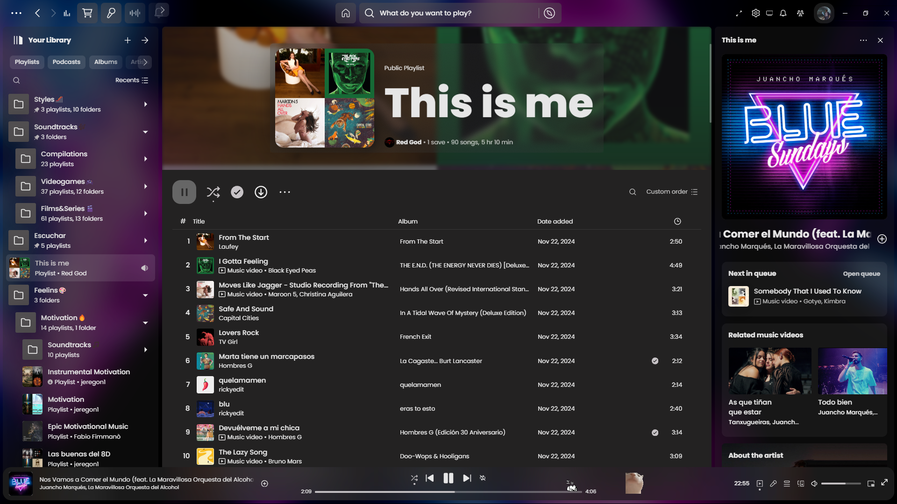
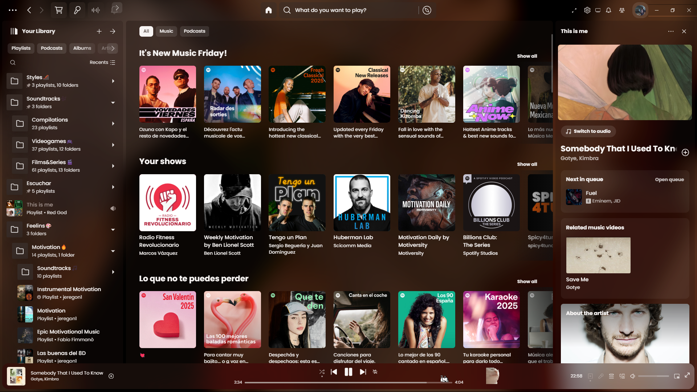
Requires reload when toggling video.

### [Text](https://github.com/spicetify/spicetify-themes/blob/master/THEMES.md#text)

Top stable, no bugs. Kinda hacker, many colors .
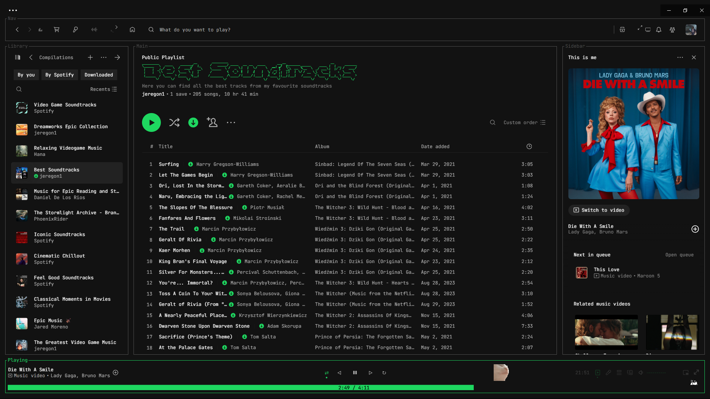

### [StarryNight](https://github.com/spicetify/spicetify-themes/blob/master/THEMES.md#starrynight)

Beautiful. No bugs.
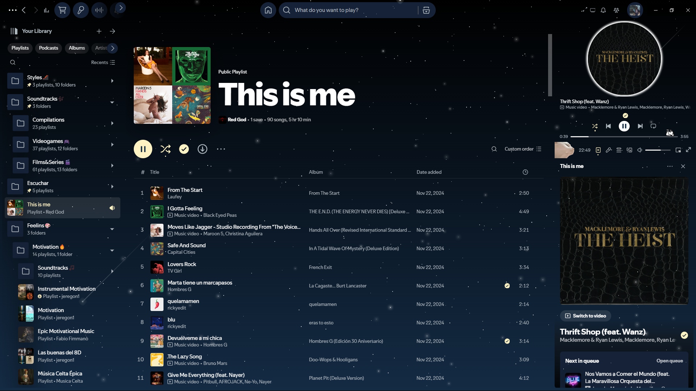

### [Dribblish Dynamic](https://github.com/JulienMaille/dribbblish-dynamic-theme)

Not buggy, dynamic in accent color and dark/light mode. Amazing.
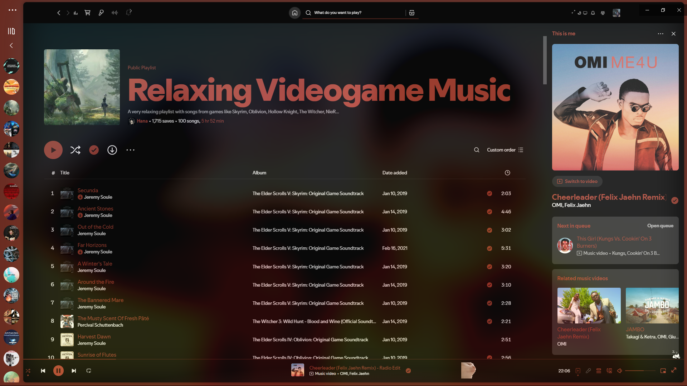
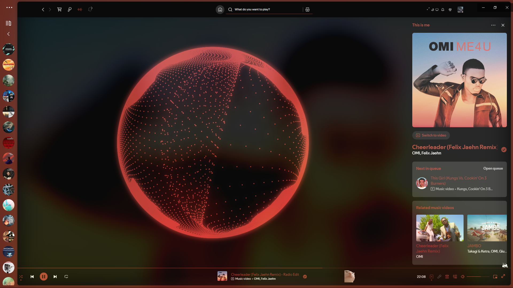

(Go to github to get the command to enable auto dark/light mode in spotify)

### [Classic Dynamic](https://github.com/JulienMaille/spicetify-dynamic-theme)

Basically classic spotify with dynamic accent color and dark/light mode. Dope.
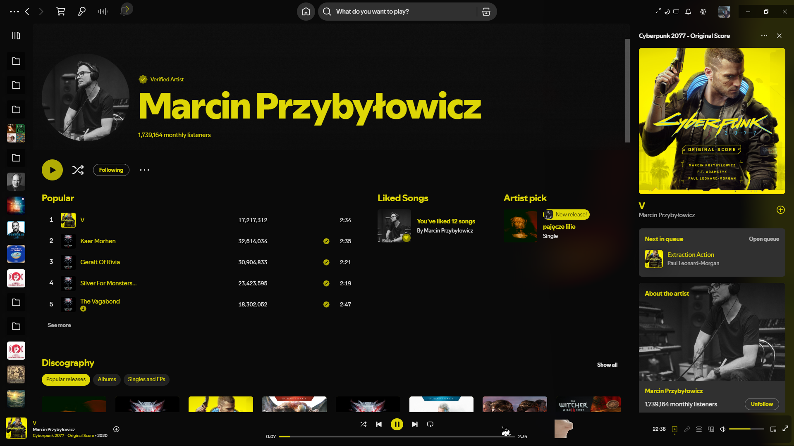

### [Catppuccin](https://github.com/catppuccin/spicetify) 

Solid, 4 major themes and many accent colors in User settings.
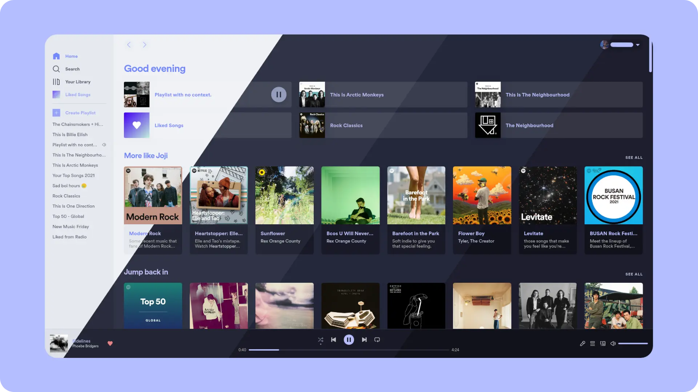

### [Sleek](https://github.com/spicetify/spicetify-themes/blob/master/THEMES.md#sleek)

Solid one, no bugs and performs well.
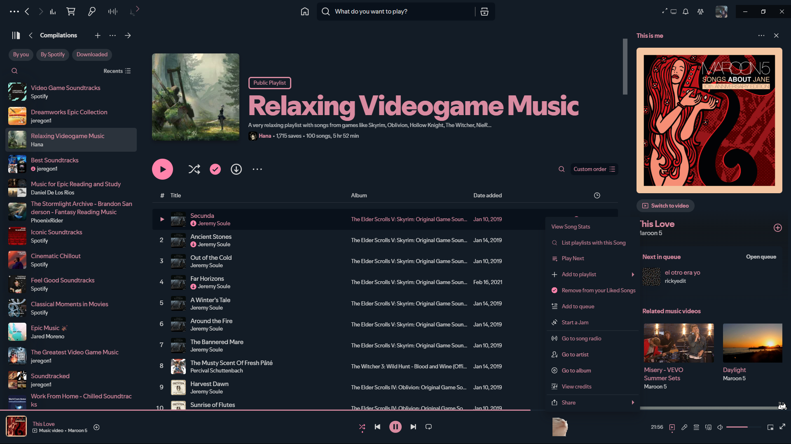

### [Ziro](https://github.com/spicetify/spicetify-themes/blob/master/THEMES.md#ziro)

Almost same looking as Sleek, and with light options.
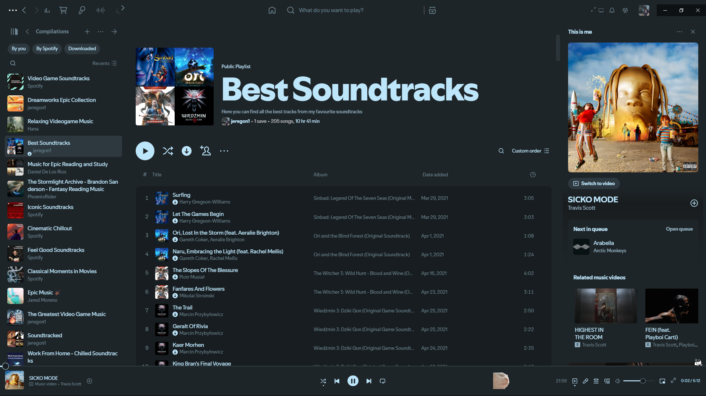

### Turntable

Original Spotify with long player bar and spinning small artwork.
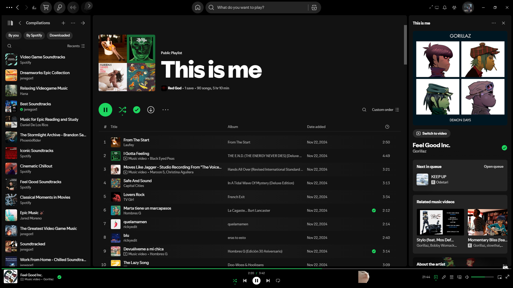

## Other themes I'd like if not for bugs

### [Bloom](https://github.com/nimsandu/spicetify-bloom)

Pretty good and several themes, but some minor bugs.
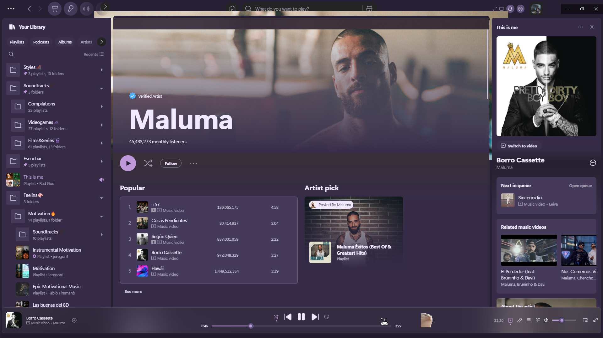

### [Dribblish](https://github.com/spicetify/spicetify-themes/blob/master/THEMES.md#dribbblish)

Currently has bugs in top bar. If not for that, very good option with tons of color schemes.
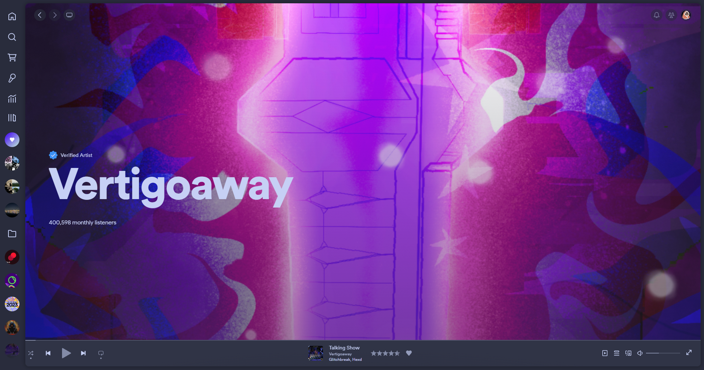

### [Fluent](https://github.com/williamckha/spicetify-fluent)

Buggy right now, not very special.
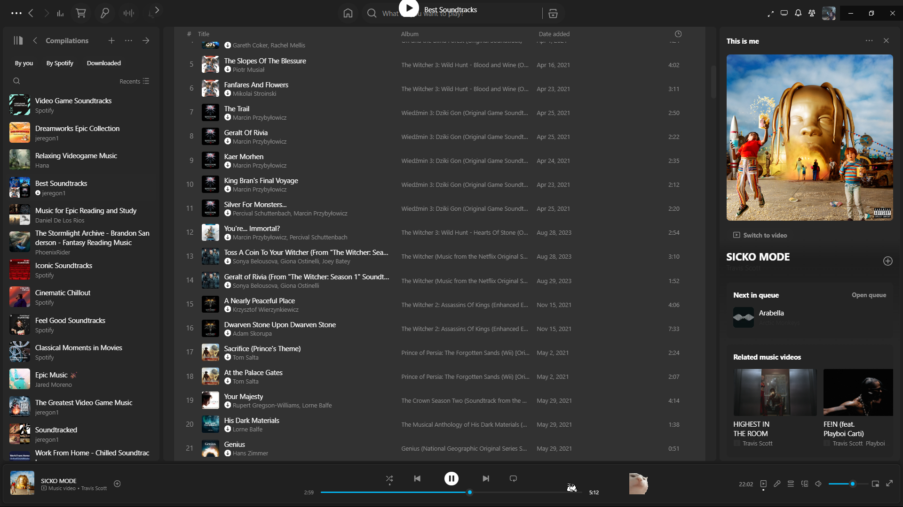

The ones I've not mentioned are not very special for me or have bugs. 
